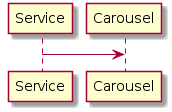

# 注册服务



注册服务时，只需发送HTTP(S)请求到/discovery/register即可，如：
```shell
curl -d "key=service-key&service=http://service-url&validate=http://localhost:8080/tephra/ctrl/status&success=^\{\"code\":0,.*" http://localhost:8080/discovery/register
{"code":0,"data":""}
```
参数说明：
- key 引用key，当不同的服务地址绑定相同key时，将在多个服务间进行负载均衡。
- service 服务URL地址。
- validate 验证服务URL地址，用以确定服务是否存活。
- success 验证服务成功返回标识，如果为空则使用默认设置，默认设置由[${carousel.discovery.success}](../src/main/resources/ds.carousel.config)定义。
