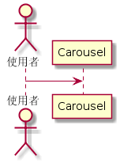

# 流程配置



配置Carousel流程，可以通过HTTP客户端工具将配置值提交到部署地址上：

```
http://ip:port/config/update
```
如果配置成功则返回：
```json
{
  "code": 0,
  "message": "配置已更新。"
}
```
## 配置规则
Carousel采用JSON格式定义配置参数，可以通过http://ip:port/config/help获取最新的配置说明：
```json
{
  "note": "*-comment为注释，不需要配置。",
  "name-comment": "流程配置名称，更新时如果不存在则新创建，已存在则更新现有配置。",
  "name": "",
  "description-comment": "流程描述。",
  "description": "",
  "actions-comment": "流程步骤集。",
  "actions": [
    {
      "name-comment": "步骤名称，在各步骤中唯一。",
      "name": "",
      "handler-comment": "处理器名称，可选值[HANDLERS]。",
      "handler": "",
      "parameter-comment": "处理器处理时需要的参数。详情请提交请求参数[?handler=]查询",
      "parameter": {}
    }
  ],
  "delay-comment": "延时执行，单位：秒。如果小于或等于0则表示立即执行；如果发起流程时设置了延迟时间则使用发起时的延迟时间设置。",
  "delay": 0,
  "interval-comment": "重复、每间隔一段时间执行一次，单位：秒。如果小于等于0则表示不重复执行。",
  "interval": 0,
  "times-comment": "重复执行次数，如果小于等于0则表示一直执行，没有停止。",
  "times": 0,
  "wait-comment": "执行流程请求时，是否等待执行结束并返回结果。0表示直接返回，1表示等待所有步骤执行完后返回执行结果。",
  "wait": 0
}
```